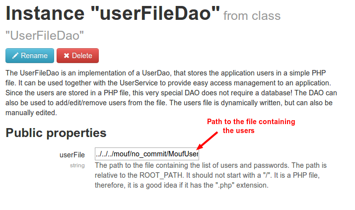

UserFileDao
===========

TL;DR?
------

This package is part of the Mouf PHP framework.
You need this package if you want to authenticate users but you don't have a database to store your users.
This package contains a "DAO" that stores your users in a file instead of a database table.

Why should I care about this package?
-------------------------------------

The Mouf PHP framework comes with a library to manage the authentication of users: the [UserService](http://mouf-php.com/packages/mouf/security.userservice).
The UserService does not make any assumption on where the users are stored. They could be stored in a relational database
like MySQL or in an object oriented database like MongoDB, etc... The only thing the UserService requires is a `UserDao`
that is in charge of retrieving the users and checking the password.

This is where this package and the `UserFileDao` comes into play.

This package contains an implementation of a UserDao that stores the application users in a simple PHP file.
It can be used together with the `UserService` to provide easy access management to an application.
Since the users are stored in a PHP file, this very special DAO does not require a database at all!

Installing
----------

This package comes as a composer package:

```php
{
	"require": {
		"mouf/security.userfiledao": "~2.0"
	}
}
```


How does it work?
-----------------

Simply create a `UserFileDao` instance in Mouf and bind it to the `userService` instance.

The only property you need to configure is the `$userFile`. It contains a path to the file that contains the list of users.



Registering a user
------------------

In order to create the file and add a user in it, you can use the `registerUser()` and `write()` methods.

```php
$userFileDao = Mouf::getUserFileDao();

// Let's create the user.
$user = new UserFileBean();
$user->setLogin("david");
// The password is hashed and never appears in cleartext in any file.
$user->setClearTextPassword("my very secret password");
// If you want to add more data, you can store them in the options:
$user->setOptions([ "option1" => 42 ]);

// Let's register the user
$userFileDao->registerUser($user);

// Finally, let's rewrite the users file.
$userFileDao->write();
```

Removing a user
---------------

Use the `removeUser()` method.

```php
$userFileDao = Mouf::getUserFileDao();

// Let's remove a user
$userFileDao->removeUser('david');

// Finally, let's rewrite the users file.
$userFileDao->write();
```

Checking whether a file containing users exists or not
------------------------------------------------------

There is a utility function to detect if a file containing users is available or not:

```php
$userFileDao = Mouf::getUserFileDao();

// Check if a user file exists or not
if (!$userFileDao->isUserFileAvailable()) {
	// Do something (maybe redirect the user to a page where he can create a user?)
}
```

Good to know
------------

This package is internally used by Mouf to store your credentials to log into the admin interface of Mouf.
If you happen to loose those credentials, you can simply delete the user file. For the Mouf PHP framework,
this file is stored in `[root path]/mouf/no_commit/MoufUsers.php`.
